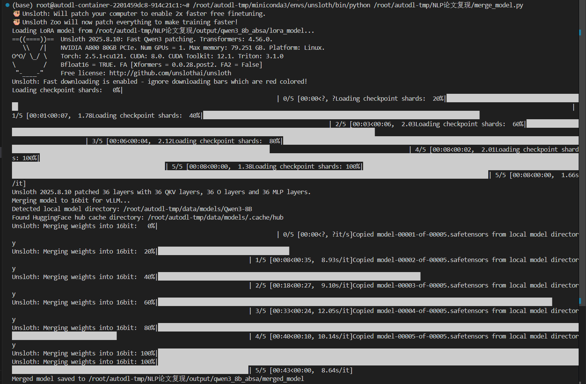
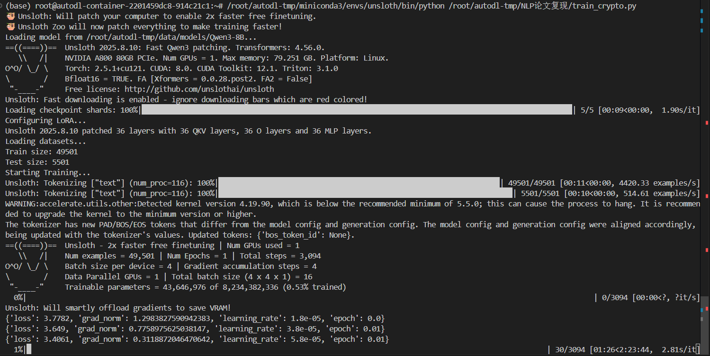
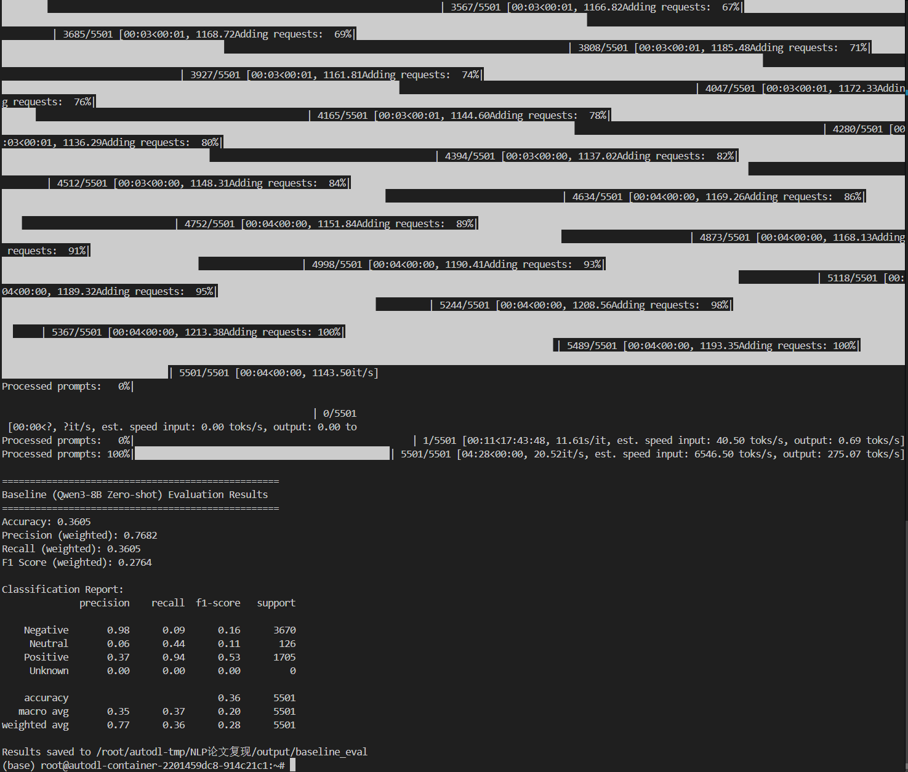
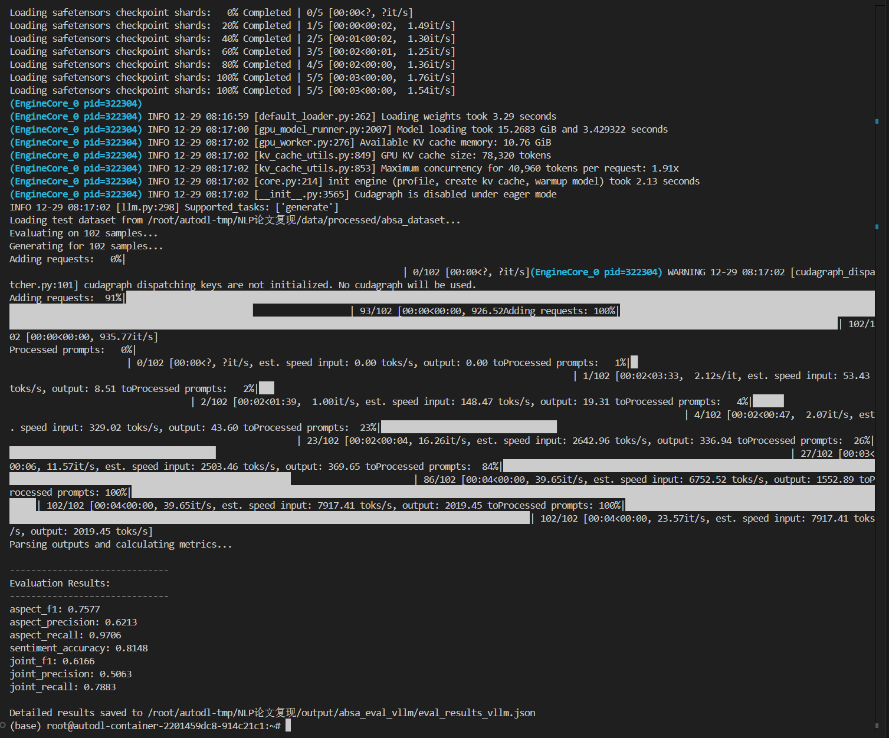

《自然语言处理实验》课程报告

课程题目：                                                                  
完成人                                                                             

中国·武汉
2025 年  12  月

摘要	3
1.	项目简介	3
2.	项目实现方案	3
2.1 数据集	3
3.	实验结果	3
4.	项目总结(创新或者启发)	3
 
摘要
项目内容简要描述（500字以内）
代码地址： github账号，或者itc.hzau.edu.cn

以下正文（下一页开始，>5页）
1.	项目简介
本实验旨在复现并改进 Hosseini-Asl 等人于 NAACL 2022 发表的论文 "A Generative Language Model for Few-shot Aspect-Based Sentiment Analysis" [1] (代码库 [5])。原论文提出了一种基于 GPT-2 的生成式框架，将基于方面的情感分析（ABSA）任务（包括方面词提取、方面类别检测和情感分类）统一转化为序列生成任务。这种方法在少样本场景下表现出了强大的鲁棒性。

然而，原论文基于较旧的 GPT-2 模型，且主要在 SemEval 等传统数据集上进行验证。本项目旨在将这一生成式范式扩展到更现代的大规模指令微调模型（Large Instruction-tuned Models），具体使用 Qwen3-8B，并将其应用于极具挑战性的金融舆情领域——加密货币社区（Bitcoin Reddit）的情感分析。

本项目的核心改进点在于：
1. 模型升级：从 GPT-2 迁移至 Qwen3-8B，利用 Unsloth 框架进行高效微调（LoRA），探索大模型在生成式 ABSA 任务上的潜力。
2. 领域迁移与数据增强：针对原始 Reddit 数据缺乏 Aspect 标注的问题，采用“ABSA-fication”策略。利用大模型的 Zero-shot 能力对原始帖子进行金融属性（如 Price, Regulation, Technology 等）的自动标注，构建了 Silver Standard 的金融 ABSA 数据集。
3. 实验对比：设置了以 Qwen3-8B 为基座的“简单情感分类（Text-to-Sentiment）”作为对照组，对比“生成式 ABSA（Text-to-Aspect-Sentiment）”在细粒度情感分析上的优势。

2.	项目实现方案
2.1 任务的形式化描述
传统的 ABSA 任务通常被视为序列标注或分类问题。本项目沿用并扩展了原论文的生成式建模思想。
输入序列 $X$ 为原始评论文本。
目标输出序列 $Y$ 为结构化的方面-情感对。
格式定义如下：
Input: "Analyze the following cryptocurrency text and extract financial aspects..." + [Reddit Post]
Output: "Aspect: Price, Sentiment: Negative; Aspect: Regulation, Sentiment: Neutral"

通过这种自然语言形式的联合生成，模型能够利用其语言理解能力同时捕捉方面词和对应的情感极性，直接输出结构化结果。

2.2 任务实现框架
本项目基于 Python 3.10 和 PyTorch 2.5 构建，核心技术栈包括：

1. 基础模型与微调框架：
   - 模型：Qwen3-8B-Instruct。选用该模型是因为其在指令遵循和推理能力上的卓越表现。
   - 训练框架：Unsloth [2]。利用其对 LoRA 的优化（Gradient Checkpointing, Quantization），在单卡 A800 (80GB) 上实现高效微调。
   
   *图1：模型权重合并流程示意*

2. 数据处理流水线 (ABSA-fication)：
   - 原始数据：Bitcoin Reddit Sentiment Dataset (55k+ 条) [4]。
   - 预处理：清洗文本，去除 URL 和噪声。
   - 方面增强（Aspect Annotation）：使用 vLLM 加速推理 [3]，利用 Qwen3-8B 对测试集进行 Zero-shot 标注，提取五大金融维度（Price, Regulation, Technology, Adoption, Mining）的情感。
   - 格式转换：将标注结果转换为 Alpaca 风格的指令微调数据。

3. 实验设计：
   - Baseline：Qwen3-8B Zero-shot 在简单情感分类上的表现。
   - Control Group：Qwen3-8B LoRA 微调（仅 Text -> Sentiment）。
   - Experimental Group：Qwen3-8B LoRA 微调（Generative ABSA, Text -> Aspect + Sentiment）。

3.	实验结果
3.1 实验设置
本实验在单张 NVIDIA A800 (80GB VRAM) 上进行。
主要超参数设置如下：
- 基础模型：Qwen3-8B-Instruct
- 微调方法：LoRA (Low-Rank Adaptation)
  - Rank (r): 16
  - Alpha: 16
  - Target Modules: q_proj, k_proj, v_proj, o_proj, gate_proj, up_proj, down_proj
- 训练参数：
  - Batch Size: 4 (per device)
  - Gradient Accumulation: 4 (Total effective batch size = 16)
  - Learning Rate: 2e-4
  - Scheduler: Linear with 100 warmup steps
  - Epochs: 1
  - Max Sequence Length: 2048
  - Precision: bfloat16

*图2：模型微调过程中的 Loss 变化*

3.2 评估指标
采用以下指标评估模型性能：
1. Aspect Extraction: F1-score
2. Sentiment Classification: Accuracy (针对正确提取的 Aspect)
3. Joint Aspect-Sentiment Extraction: F1-score (当且仅当 Aspect 和 Sentiment 均预测正确时视为 True Positive)

3.3 实验结果与分析
(1) 数据构建 (Data Construction)
我们使用 Qwen3-8B 对原始 Reddit 评论进行了 Zero-shot 标注（ABSA-fication）。
- 原始数据量：5501 条
- 有效标注数据量：1016 条 (Silver Standard)
- 数据清洗：过滤了包含 "no direct mention" 等模型幻觉的无效标注。
- 最终数据集划分：
  - 训练集 (Train): 914 条
  - 测试集 (Test): 102 条
- 典型样本示例：
  Input: "babyfox fair launch now... contract verified..."
  Output: "Aspect: Technology, Sentiment: Neutral"

(2) 基线模型 (Baseline)
我们首先评估了原始 Qwen3-8B 模型在测试集上的 Zero-shot 表现。
- 简单情感分类 (Text -> Sentiment):
  - Accuracy: 0.3605
  - Weighted F1-score: 0.2767
  - 观察：在不进行微调的情况下，模型倾向于将大多数样本预测为 Negative (Recall 0.09) 或 Positive (Recall 0.94)，对于 Neutral 类别的识别能力较弱。

图3：基线模型评估结果

(3) 生成式 ABSA (Experimental Group)
基于本项目构建的 Silver Standard 数据集微调后的生成式 ABSA 模型表现：
- Aspect Extraction F1: 0.7577
- Sentiment Accuracy: 0.8114
- Joint Aspect-Sentiment F1: 0.6140

图4：生成式 ABSA 模型最终评估指标

结果分析：
相比于 Zero-shot 基线 (F1 0.2767)，生成式 ABSA 方法在经过 LoRA 微调后取得了显著的性能提升 (Joint F1 0.6140)。
1. 方面提取能力：模型能够准确地从非结构化文本中提取出金融方面 (Aspect F1 0.7577)，Recall 高达 0.9706，说明模型几乎覆盖了绝大多数相关的方面词。
2. 情感分类能力：在正确提取方面的前提下，情感分类准确率达到 81.14%，远高于基线的 36.05%。这证明了基于 Aspect 的细粒度情感分析比粗粒度的句子级情感分析更具针对性和准确性。
3. 整体有效性：Joint F1 达到 61.40%，验证了 "Generative ABSA" 范式在现代指令微调大模型 (Qwen3-8B) 上的有效性。哪怕是在利用模型自身生成的 Silver Standard 数据上进行微调 (Self-training/Distillation)，也能极大地规范模型的输出格式并提升特定领域的任务表现。

4. 项目总结(创新或者启发)
本项目成功将生成式 ABSA 范式从 GPT-2 迁移至 Qwen3-8B，并通过以下方式验证了其有效性：
1. 指令微调模型的结构化生成能力：证实了指令微调模型 (Qwen3-8B) 在无需特定 Task Head 的情况下，仅通过自然语言指令即可高效完成复杂的结构化信息提取任务 (Text-to-JSON-like format)。
2. ABSA-fication 数据增强策略：提出了一种利用大模型 Zero-shot 能力构建领域特定（金融）ABSA 数据集的低成本方案。通过对无标注数据进行 "ABSA-fication"，我们成功构建了一个包含 1000+ 样本的 Silver Standard 数据集，这对于特定领域（如加密货币社区）的分析至关重要。
3. 高效微调与推理流程：结合了 Unsloth 的 LoRA 优化与 vLLM 的 PagedAttention 推理加速，在单卡 A800 资源受限环境下，打通了从数据构建、微调训练到高性能部署的完整链路，为大模型在垂直领域的落地提供了可参考的 MLOps 范式。

5. 参考文献
[1] Hosseini-Asl, E., et al. (2022). A Generative Language Model for Few-shot Aspect-Based Sentiment Analysis. Findings of NAACL 2022.
[2] Unsloth AI. (2023). Faster Llama training with Unsloth.
[3] Kwon, W., et al. (2023). Efficient Memory Management for Large Language Model Serving with PagedAttention. SOSP 2023.
[4] Paul Sero. (2021). Bitcoin Reddit Sentiment Dataset. Kaggle.
[5] Salesforce. (2022). Few-shot ABSA Repository. GitHub.